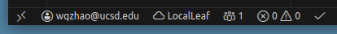

  

# LocalLeaf: Local LaTeX Editing yet Synced to Overleaf

A VS Code extension for a workaround solution to collaborate on LaTeX documents using [Overleaf](https://www.overleaf.com/) while editing them locally.

## Features

- **Two-way sync** with Overleaf projects
- **Real-time collaboration** - see collaborators' cursors
- **Conflict resolution** with visual diff view
- **Auto-sync** on file changes
- **Ignore patterns** support (like `.gitignore`)
- **Source Control integration** with LocalLeaf pull/push actions

> **Status bar items** showing Overleaf account, sync status, real-time collaboration status.
> Also shown on the right in this example includes VS Code's error/warning indicators and LaTeX Workshop's build status.
> 

## Getting Started

1. Install the extension from the [VS Code Marketplace](https://marketplace.visualstudio.com/items?itemName=teddy-van-jerry.localleaf)
2. Run `LocalLeaf: Login` command and enter your Overleaf cookies (see [how to get cookies](https://github.com/overleaf-workshop/Overleaf-Workshop/blob/master/docs/wiki.md#login-with-cookies))
3. Open a folder and run `LocalLeaf: Link Folder to Overleaf Project`
4. Start editing - changes sync automatically!

> [!WARNING]
> - Only paste cookies when the server URL is the real Overleaf host (`https://www.overleaf.com`). The extension sends the cookie to whatever URL you enter; avoid lookalike URLs such as `https://www.overleaf.com.attacker.test` or ones that hide another host (e.g., `https://www.overleaf.com@evil.com`).
> - Cookies are stored in VS Code Secret Storage, not in your workspace, but they still grant full account access. Treat them like a password and clear credentials with `LocalLeaf: Logout` if you suspect exposure.

## Commands

| Command | Description |
|---------|-------------|
| `LocalLeaf: Login` | Authenticate with Overleaf |
| `LocalLeaf: Logout` | Clear stored credentials |
| `LocalLeaf: Verify Credentials` | Check if your session is still valid |
| `LocalLeaf: Refresh Cookie` | Re-authenticate without full re-login |
| `LocalLeaf: Link Folder to Overleaf Project` | Connect a local folder to an Overleaf project |
| `LocalLeaf: Unlink Folder` | Disconnect folder from Overleaf project |
| `LocalLeaf: Sync Now` | Manually trigger two-way sync |
| `LocalLeaf: Pull from Overleaf` | Download changes from Overleaf |
| `LocalLeaf: Push to Overleaf` | Upload local changes to Overleaf |
| `LocalLeaf: Show Sync Status` | Display sync status and options to resync/reconnect |
| `LocalLeaf: Edit Ignore Patterns` | Configure files to exclude from sync |
| `LocalLeaf: Set Main Document` | Set the main `.tex` file for compilation |
| `LocalLeaf: Configure Settings` | Open extension settings |
| `LocalLeaf: Jump to Collaborator` | Navigate to a collaborator's cursor position |

## Settings

| Setting | Default | Description |
|---------|---------|-------------|
| `localleaf.defaultServer` | `https://www.overleaf.com` | Overleaf server URL (for self-hosted instances) |
| `localleaf.autoSync` | `true` | Automatically sync when files change |
| `localleaf.gitCommitAutoPush` | `true` | In manual mode, auto-push LocalLeaf changes to Overleaf after successful VS Code Git commits |

## Source Control Integration

- LocalLeaf appears as a lightweight provider in VS Code's **Source Control** tab when the folder is linked.
- The LocalLeaf provider exposes **Pull from Overleaf** and **Push to Overleaf** actions in SCM.
- Overleaf file-level local/remote/conflict lists remain in the LocalLeaf **Changes** panel.
- Git-triggered auto-push is supported for commits made through VS Code's Git integration only.
- Auto-push runs only in **manual sync mode** and skips when conflicts are detected, then prompts you to resolve via the Changes panel/diff.

## Philosophy

LocalLeaf focuses solely on **local file synchronization** with Overleaf. Unlike browser-based solutions, LocalLeaf:

- **Creates a local replica** of your Overleaf project that you can edit with any tool
- **Does not provide online PDF compilation** - use Overleaf's web interface or local tools for that
- **Works seamlessly with [LaTeX Workshop](https://marketplace.visualstudio.com/items?itemName=James-Yu.latex-workshop)** for local editing, compilation, and preview

This approach gives you the best of both worlds: Overleaf's collaboration features and your preferred local editing environment.

## Related Projects

This project was inspired by and references [Overleaf-Workshop](https://github.com/iamhyc/Overleaf-Workshop), which takes a different approach by providing a more integrated Overleaf experience within VS Code, including online PDF preview and compilation. LocalLeaf instead focuses on maintaining a synchronized local copy of your files, leaving PDF compilation to dedicated tools like LaTeX Workshop or Overleaf's web interface.

## Attribution

The LocalLeaf logo is an original Minecraft-style pixelated design depicting a leaf growing from local ground, inspired by the [Overleaf logo](https://commons.wikimedia.org/wiki/File:Overleaf_Logo.svg). LocalLeaf is not affiliated with or endorsed by Overleaf.

## License

[MIT](LICENSE)
