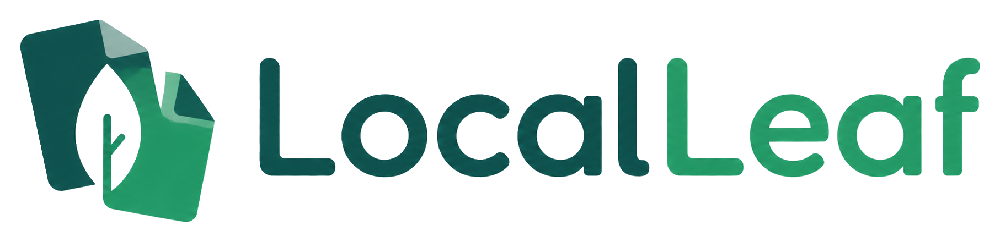

<p align="center">
  
</p>

# LocalLeaf Community

[](LICENSE)
[](CONTRIBUTING.md)

LocalLeaf Community lets you work on Overleaf projects from VS Code while keeping a real local copy of every file. It is the continuation of [LocalLeaf](https://github.com/Teddy-van-Jerry/LocalLeaf), the extension created by Teddy van Jerry, and is now maintained here with contributions from the wider community.

LocalLeaf Community is an independent, community-maintained continuation. It is not sponsored, endorsed, or maintained by Teddy van Jerry or by Overleaf.

The idea is deliberately simple: write with the local tools you already like, and let LocalLeaf keep the project in step with Overleaf.

## What it can do

- Synchronize files in both directions with Overleaf and self-hosted Overleaf instances
- Show and link remote projects from the VS Code sidebar
- Sign in through an isolated Chrome or Edge window, with manual cookies as a fallback
- Keep documents updated in real time
- Show collaborators and jump to their cursor positions
- Help resolve local and remote conflicts with a visual diff
- Ignore build output and other generated files through `.leafignore`
- Preview and remove ignored folders or files that exist only on Overleaf, while keeping local files
- Work alongside LaTeX Workshop for local compilation and PDF preview

## Installation

Install [LocalLeaf Community from the Visual Studio Marketplace](https://marketplace.visualstudio.com/items?itemName=victorstoica114.localleaf-community), or search for `LocalLeaf Community` in the VS Code Extensions view.

For a manual or offline installation, download the latest `.vsix` from [GitHub Releases](https://github.com/victorstoica114/LocalLeaf-Community/releases/latest), then run **Extensions: Install from VSIX...** in VS Code.

To build the extension yourself:

```powershell
npm install
npm test
npx @vscode/vsce package
```

If the original Marketplace extension is installed, disable or uninstall it first. Both versions currently keep the same commands and workspace format, so existing LocalLeaf projects continue to work.

## Contributing

Contributions are welcome, whether they are code, documentation, bug reports, or testing against different Overleaf installations. The most useful starting points and the local development commands are collected in [CONTRIBUTING.md](CONTRIBUTING.md).

## Getting started

1. Open the folder that should contain your local project.
2. Run `LocalLeaf: Login`, choose your server and browser, then finish signing in in the isolated browser window.
3. Choose a project from the LocalLeaf sidebar and link it to the folder.
4. New remote files download automatically. If local and remote copies differ, choose which copy to keep in the conflict prompt.

> [!WARNING]
> Your Overleaf cookies grant access to your account. Only send them to the real server you intend to use, check the URL carefully, and treat them like a password. LocalLeaf stores them in VS Code Secret Storage rather than inside the workspace. Use `LocalLeaf: Logout` if you suspect they were exposed.

Browser login uses a temporary, isolated Chromium profile and removes it after the session is captured. If cleanup is blocked by another process, LocalLeaf reports the exact temporary folder so you can remove it manually. If the extension is running on a remote extension host (Remote SSH, WSL, or a Dev Container), use the manual cookie option because the browser cannot be opened safely on your local desktop from that host.

## Commands

| Command | What it does |
|---------|--------------|
| `LocalLeaf: Login` | Opens the Account panel for browser or manual-cookie login |
| `LocalLeaf: Logout` | Removes the stored credentials |
| `LocalLeaf: Verify Credentials` | Checks whether the current session is still valid |
| `LocalLeaf: Re-authenticate` | Opens the Account panel to replace an expired session |
| `LocalLeaf: Link Folder to Overleaf Project` | Links the current folder to a project |
| `LocalLeaf: Unlink Folder` | Removes the local project link |
| `LocalLeaf: Sync Now` | Starts a two-way synchronization |
| `LocalLeaf: Pull from Overleaf` | Downloads the latest remote state |
| `LocalLeaf: Push to Overleaf` | Explains the automatic push behavior |
| `LocalLeaf: Edit Ignore Patterns` | Opens `.leafignore` |
| `LocalLeaf: Clean Remote Files` | Select ignored folders and remote-only files to delete from Overleaf; local files are kept |
| `LocalLeaf: Show Sync Status` | Shows the connection and synchronization state |
| `LocalLeaf: Set Main Document` | Selects the primary `.tex` document |
| `LocalLeaf: Configure Settings` | Opens the extension settings |
| `LocalLeaf: Jump to Collaborator` | Opens a collaborator's current document and position |
| `LocalLeaf: Remove Standalone LaTeX Comments` | Previews and removes full-line comments with confirmation and Undo support |

## Settings

| Setting | Default | Description |
|---------|---------|-------------|
| `localleaf.defaultServer` | `https://www.overleaf.com` | Overleaf or self-hosted server URL |
| `localleaf.autoSync` | `true` | Upload local filesystem changes automatically; remote collaboration remains connected when disabled |

## The people behind the project

LocalLeaf was started by **Teddy van Jerry (Wuqiong Zhao)**, who designed and built the original extension and maintained its first releases. **Xingyu Chen (Asixa / RFDT)** later contributed a substantial 34-commit proposal for a broader interface, synchronization workflow, local compilation, PDF tooling, and Source Control integration in PR #3. **Victor Stoica** integrated and hardened parts of that work, fixed synchronization and security issues, and now maintains this continuation.

The full story is in [ATTRIBUTION.md](ATTRIBUTION.md), and the commit-by-commit review is in [docs/CONTRIBUTOR_INTEGRATION.md](docs/CONTRIBUTOR_INTEGRATION.md). Asixa's original PR history is preserved in the `archive/asixa-pr-3` branch, while equivalent authored commits are present on the default branch for contributor visibility.

## Related projects

LocalLeaf was inspired by [Overleaf-Workshop](https://github.com/iamhyc/Overleaf-Workshop), which offers a more deeply integrated Overleaf experience inside VS Code. LocalLeaf takes a different route: it keeps a normal local project that remains usable with Git, LaTeX Workshop, scripts, and any other local tool.

LocalLeaf and LocalLeaf Community are not affiliated with or endorsed by Overleaf.

## License

The project is distributed under the [MIT License](LICENSE). Teddy's original copyright notice is kept intact, with a separate notice for the community's later work. See [NOTICE](NOTICE), [ATTRIBUTION.md](ATTRIBUTION.md), and [THIRD_PARTY_NOTICES.md](THIRD_PARTY_NOTICES.md) for project history, credits, and dependency licenses.
