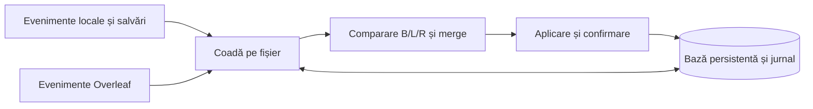

**Evaluarea sincronizării LocalLeaf — 11 septembrie 2026**

Recomandare: un coordonator de sincronizare pentru fiecare fișier, cu bază comună persistentă, evidența operațiilor neconfirmate și merge în trei versiuni. Pentru colaborarea live, acesta trebuie să respecte protocolul OT folosit efectiv de Overleaf. Remedierea evenimentelor pentru directoare este un pas separat, imediat.

Evaluarea privește codul local 0.2.11, peste commitul `b2aa37d`, inclusiv modificările încă necomise. Au fost citite surse upstream la revizii fixe, consultate documentația și un PR relevant, reproduse două comportamente ale motorului actual și executate prototipuri izolate. Prototipurile folosesc date sintetice; nu publică modificări pe server. Auto-merge-ul descris aici nu este încă integrat în extensie.

**Eroarea raportată și ce putem afirma**

Am reprodus mesajul `Failed to sync: Error: Refusing to read a non-file synchronization path` trimițând către motor un eveniment de modificare pentru directorul sintetic `data`. Starea devine `error`, deși socketul rămâne conectat și documentul remote nu se schimbă.

Traseul este `setupLocalWatcher → handleLocalFileChange → readLocalFile`. Handlerul citește conținutul înainte să clasifice tipul entității. Protecția din `readLocalFile` funcționează corect; rutarea evenimentului trebuie corectată. Vezi [watcher și citire](../src/sync/syncEngine.ts), funcțiile respective. API-ul VS Code distinge explicit directoare, fișiere și legături prin `FileStat.type`; numele evenimentului nu justifică presupunerea că URI-ul este un fișier obișnuit. [VS Code API](https://code.visualstudio.com/api/references/vscode-api#FileStat).

Logul curent conține uploaduri reușite și verificări pentru 72–107 documente între aproximativ 17:33 și 18:07 UTC. Mesajul complet, cu calea reală din captură, nu apare în logurile consultate. Reproducerea identifică un defect concret și compatibil cu captura; nu demonstrează că toate erorile observate au aceeași cauză.

**Lipsurile confirmate în implementarea noastră**

| Observație în cod | Efect asupra comportamentului |
|---|---|
| `baseContent` și `baseHashes` sunt hărți în memorie, șterse la închiderea motorului | După restart pierdem informația necesară pentru a deosebi editările locale de cele remote și pentru un merge sigur. |
| `pushDocumentChanges` și `performPullAll` cer o alegere când ambele copii diferă de bază | Modificări independente, în secțiuni diferite, produc tot o notificare. Am reprodus acest caz. |
| `calculateOps` produce o singură înlocuire între prefixul și sufixul comune | Două editări îndepărtate includ în operație și textul neschimbat dintre ele; cresc volumul transferat și zona care trebuie transformată. |
| Există snapshoturi versionate și așteptare pentru `otUpdateApplied`, dar nu un model complet pentru operația în curs și editările acumulate după ea | O confirmare pierdută sau o editare concurentă necesită reconciliere explicită. Un timeout singur nu spune dacă serverul a aplicat operația. |
| `fileCache` este folosit și pentru evitarea ecourilor, și în unele cazuri de conflict păstrat local | Egalitatea cu acest cache nu este o dovadă suficientă că fișierul este sincronizat. Sunt necesare responsabilități distincte. |
| Starea globală se schimbă din operații individuale | Un director poate produce „Error”; succesul altui fișier poate modifica ulterior starea. Avem nevoie de stări pe fișier și un sumar calculat. |
| Verificarea periodică actuală revalidează documentele deja cunoscute | Nu garantează descoperirea unui eveniment structural ratat. `refreshProjectFileTree` poate păstra arborele existent dacă serverul nu îl expune prin HTTP. |

Corecțiile existente pentru autentificare, limite, căi, fișiere mari, restaurări, notificări fără blocare și confirmări remote trebuie păstrate. Evaluarea indică unde trebuie întărit modelul, nu justifică eliminarea acestor protecții.

**Sursele care merită folosite**

| Proiect și sursă inspectată | Ce merită preluat | Condiții și limite |
|---|---|---|
| [Overleaf: clientul ShareJS](https://github.com/overleaf/overleaf/blob/28ad3b03b71cb4311decdcb55c36b33ec10d72db/services/web/frontend/js/vendor/libs/sharejs.js) și [tipul text](https://github.com/overleaf/overleaf/blob/28ad3b03b71cb4311decdcb55c36b33ec10d72db/services/document-updater/app/js/sharejs/types/text.js) | Semantica reală pentru versiuni, confirmări, operații concurente și transformări. Tipul text și helperul sunt cei mai apropiați de formatul nostru `{p,i,d}`. | Overleaf are licență AGPL; subdirectorul `document-updater/app/js/sharejs` are propria [licență MIT](https://github.com/overleaf/overleaf/blob/28ad3b03b71cb4311decdcb55c36b33ec10d72db/services/document-updater/app/js/sharejs/LICENSE). Acest lucru nu atribuie automat MIT întregului client web. |
| [ShareDB: `lib/client/doc.js`](https://github.com/share/sharedb/blob/76594a30566062a55901da7e4ffad5247dc4ed2d/lib/client/doc.js) | Separarea operației neconfirmate de coada ulterioară, transformarea ambelor la primirea unei operații remote, resubscrierea și identificarea confirmărilor. | [MIT](https://github.com/share/sharedb/blob/76594a30566062a55901da7e4ffad5247dc4ed2d/LICENSE). Merită modelul și teste adaptate. Clientul ShareDB nu poate fi conectat direct la protocolul Overleaf fără adaptor. |
| [node-diff3](https://github.com/bhousel/node-diff3/blob/8226c27e074909241d72276c21215505a931665f/src/diff3.mjs) | `diff3Merge(local, base, remote)` produce regiuni curate și conflicte explicite. Primul candidat pentru reconcilierea fișierelor text după editări independente. | [MIT](https://github.com/bhousel/node-diff3/blob/8226c27e074909241d72276c21215505a931665f/LICENSE.md). Necesită tokenizare care păstrează spațiile și newline-urile, plus buget de calcul. |
| [jsdiff](https://github.com/kpdecker/jsdiff) | Diferențe granulare pentru generarea operațiilor, în locul înlocuirii unui interval mare. API-ul oferă `timeout` și `maxEditLength`. | [BSD-3-Clause](https://github.com/kpdecker/jsdiff/blob/87c5152b9b3908d8364e875aabce8f4015c7fe0e/LICENSE). `diffChars` lucrează cu puncte de cod Unicode; adaptorul nostru trebuie să calculeze pozițiile OT în unitățile UTF-16 ale serverului. |
| [Overleaf Workshop: replica locală](https://github.com/overleaf-workshop/Overleaf-Workshop/blob/08b65b290a830202b09f6a32f8340dd0b90dc16c/src/scm/localReplicaSCM.ts) | Clasificarea fișier/director înainte de citire; separarea surselor de evenimente; opțiunea pentru sincronizarea schimbărilor produse de programe externe. | [AGPL-3.0](https://github.com/overleaf-workshop/Overleaf-Workshop/blob/08b65b290a830202b09f6a32f8340dd0b90dc16c/LICENSE). Referință arhitecturală; copierea trebuie evaluată separat față de licența MIT a LocalLeaf. |
| [Syncthing: planificarea scanărilor](https://github.com/syncthing/syncthing/blob/2ca95cf1498104113fdfde46df4107f2450a0f71/lib/model/folder.go) și [aplicarea schimbărilor](https://github.com/syncthing/syncthing/blob/2ca95cf1498104113fdfde46df4107f2450a0f71/lib/model/folder_sendrecv.go) | Watcherul declanșează verificarea stării curente; scanări suplimentare, fișiere temporare, verificare înainte de înlocuire, păstrarea copiilor conflictuale. | Go, [MPL-2.0](https://github.com/syncthing/syncthing/blob/2ca95cf1498104113fdfde46df4107f2450a0f71/LICENSE). Împrumutăm principiile și scenariile de test, fără a integra întregul motor. |

Workshop are chiar un [PR despre pierderea sincronizării și evenimentele de salvare](https://github.com/overleaf-workshop/Overleaf-Workshop/pull/374), integrat la 8 iulie 2026. Codul rezultat închide socketurile anterioare, curăță listenerii și oferă sincronizare la salvare, cu opțiune pentru modificări externe. Pentru LocalLeaf aș păstra suportul pentru fișiere generate extern, deoarece proiectul utilizatorului folosește astfel de date, dar aș introduce stabilizarea scrierilor și o politică explicită. Un eveniment FS este un indiciu că trebuie verificat fișierul, nu o operație remote gata de executat.

Nu aș copia algoritmul de merge din replica Workshop: când baza lipsește, ramura inspectată poate scrie remote peste copia locală existentă; în cealaltă ramură aplică patchuri și ignoră vectorul `_results`. În plus, baza este tot în memorie. Aceste alegeri nu oferă garanțiile cerute aici. [Implementarea inspectată](https://github.com/overleaf-workshop/Overleaf-Workshop/blob/08b65b290a830202b09f6a32f8340dd0b90dc16c/src/scm/localReplicaSCM.ts#L243).

Am evaluat și [Yjs](https://github.com/yjs/yjs). Este potrivit pentru colaborare bazată pe CRDT, dar Overleaf folosește protocolul OT de mai sus. Recomandarea mea este să păstrăm compatibilitatea directă cu serverul; introducerea Yjs ar necesita un adaptor suplimentar între două modele de editare. Acesta este un cost arhitectural dedus din diferența de protocoale.

Nici pachetul modern [`ottypes/text`](https://github.com/ottypes/text) nu este un înlocuitor direct al tipului text din server: operațiile lui folosesc traversări cu numere, șiruri și ștergeri numerice. `text-unicode` schimbă și unitatea pozițiilor. Trebuie verificat formatul exact al serverului, nu aleasă biblioteca doar după nume.

**Rezultatele prototipurilor**

| Experiment izolat | Rezultat |
|---|---|
| Eveniment pentru un director în motorul actual | Mesajul din captură reprodus, socket conectat. |
| Editări în două secțiuni LaTeX diferite, motorul actual | Solicită alegere; nu face auto-merge. |
| Aceleași editări prin `node-diff3` | Ambele păstrate automat. |
| Aceeași schimbare efectuată în ambele copii | Rezultat curat, fără dublarea schimbării. |
| Modificări incompatibile pe aceeași linie | Conflict explicit. |
| Ștergere într-o copie și editare în cealaltă | Conflict explicit. |
| Două conținuturi noi diferite, cu strămoș gol cunoscut | Conflict explicit. Un strămoș necunoscut trebuie tratat separat de coordonator. |
| Emoji, spații, linii goale, lipsa newline-ului final | Păstrate în exemplul testat. |
| Editări independente în același paragraf scris pe o singură linie | Merge-ul pe linii semnalează conservator conflict. Granularitatea mai fină este o etapă ulterioară. |
| Tipul OT efectiv din ShareJS/Overleaf | Patru exemple converg indiferent de ordinea aplicării: poziții diferite, inserții simultane, inserție în zona unei ștergeri, poziții după emoji. |

Pachetul publicat `node-diff3@3.2.1` a fost descărcat separat, verificat față de integritatea SHA-512 din registry și încărcat prin CommonJS în Node `v24.18.0`. Exemplul simplu de merge a trecut. Metadatele publicate declară un engine Bun; testul confirmă încărcarea acestui artefact în Node-ul local, nu întreaga matrice de versiuni VS Code/Electron.

Performanță orientativă: 10.000 de linii distincte au necesitat aproximativ 160–217 ms în două rulări. 1.000 de rânduri identice au necesitat aproximativ 823 ms; testul cu 10.000 de rânduri repetitive a fost oprit la bugetul de 1,5 secunde. Sunt măsurători locale, nu limite garantate. Merge-ul trebuie executat într-un worker cu limită de memorie, timp și dimensiune; expirarea bugetului păstrează copiile și produce o stare vizibilă pentru acel fișier.

Scripturile și rezultatele izolate sunt în `.tmp-sync-research/`: `evaluate.cjs`, `evaluation-results.json`, `merge-budget.cjs`, `ot-convergence.cjs`, `check-published.cjs`. `sources.json` păstrează reviziile și hashurile surselor inițiale. Nu au fost adăugate dependențe de producție.

**Comportamentul propus pentru utilizator**

Notăm cu B ultima copie comună confirmată, L copia locală și R copia remote. Lipsa lui B este o stare distinctă de un fișier B gol.

| Situație | Decizie |
|---|---|
| Folder nou, fără istoric; L lipsește, R există | Download automat. Un folder cu doar metadate Git intră aici. |
| L și R sunt identice | Se înregistrează starea comună confirmată. |
| L = B, R s-a schimbat | Se aplică schimbarea remote, verificând că între timp copia locală nu s-a modificat. |
| R = B, L s-a schimbat | Se trimite conținutul local salvat, conform setării auto-sync. |
| Ambele s-au schimbat și există B complet | Merge în trei versiuni. Rezultatul fără conflicte este aplicat și confirmat automat. |
| Ambele s-au schimbat incompatibil sau B nu este disponibil | Se păstrează copiile; se afișează conflictul pe acel fișier. Celelalte fișiere continuă. |
| Fișier cunoscut șters pe una dintre părți | Se propagă ștergerea doar dacă cealaltă copie este neschimbată și observația este validă. Editare versus ștergere păstrează conținutul pentru rezolvare. |
| PDF, imagine sau fișier de date regenerat | Transfer verificat și politică de conflict; fără merge textual automat implicit. |

Pentru `.tex`, `.bib`, `.md`, `.sty` și `.cls`, merge-ul pe linii este primul pas potrivit. Tokenizarea trebuie să păstreze exact conținutul; separatorul implicit pe whitespace al bibliotecii nu este adecvat. Un merge textual curat nu garantează corectitudinea semantică a unui document LaTeX.

Un buffer nesalvat este o revizie locală separată. Modificările remote compatibile pot fi aplicate prin mecanismul editorului, cu verificarea versiunii și păstrarea stării nesalvate; nu transformăm automat drafturile în uploaduri. Markerele de conflict nu se publică pe Overleaf.

**Organizarea recomandată**

1. **Normalizarea evenimentelor.** Clasificăm fișier/director/symlink înainte de citire, grupăm evenimentele repetitive și verificăm că scrierea s-a stabilizat. Gestionăm salvarea prin înlocuire temporară și operațiile Git. Protecțiile pentru căi și ignore rămân active.
2. **Stare persistentă.** Un manifest per server/proiect/workspace păstrează identitățile remote, versiunile, hashurile, referința către conținutul B și intențiile neconfirmate. Starea se scrie tranzacțional. B nu este avansat pentru conținut doar observat remote sau pentru un upload cu rezultat necunoscut. Conținutul necesar rezolvării unui conflict nu este evacuat din cache fără o copie persistentă.
3. **Coordonator per document.** Separă snapshotul serverului, operația trimisă și editările acumulate ulterior. Modificările remote transformă operațiile locale restante. ACK-urile și operațiile duplicate sunt tratate conform protocolului Overleaf; schema `src/seq` din ShareDB nu se copiază presupunând că serverul o acceptă. La pierderea confirmării se verifică starea autoritativă înainte de repetare.
4. **Transferuri și structură.** Documentele OT, atașamentele, directoarele și ștergerile au operații distincte. Folosim identități stabile și verificăm din nou destinația înainte de aplicare. Pentru fișiere închise: temporar și înlocuire verificată; pentru editor deschis: versiune și editare prin VS Code. Reconcilierea structurală trebuie să obțină un arbore proaspăt printr-o cale suportată de server.
5. **Stare și observabilitate.** Separăm conexiunea de progresul fișierelor: „conectat, 2 uploaduri în așteptare, 1 conflict”. Logul include tipul evenimentului, calea relativă, etapa, versiunea remote și operația locală; nu conținutul documentelor. „Up to date” presupune lipsa operațiilor și conflictelor restante.

OT și merge-ul în trei versiuni au roluri complementare: primul gestionează operații concurente cu istoric cunoscut; al doilea reconciliază copii după perioade offline sau când istoricul operațiilor nu mai este disponibil. Pentru formatul wire, [clientul Overleaf](https://github.com/overleaf/overleaf/blob/28ad3b03b71cb4311decdcb55c36b33ec10d72db/services/web/frontend/js/vendor/libs/sharejs.js#L901) este referința, iar [ShareDB](https://github.com/share/sharedb/blob/76594a30566062a55901da7e4ffad5247dc4ed2d/lib/client/doc.js#L329) oferă o separare utilă a stărilor.

**Ordinea de implementare și criteriile de acceptare**

| Etapă | Rezultat verificabil înainte de distribuire |
|---|---|
| 1. Evenimente și stare pe fișier | Evenimentele pentru directoare și scrierile temporare nu produc eroare globală; fișierele cu probleme sunt identificabile în panou și log. |
| 2. Bază persistentă și jurnal | Restartul în orice etapă păstrează modificările locale și nu interpretează un clone gol drept ștergerea întregului proiect. |
| 3. Coordonator și auto-merge | Două copii cu editări în secțiuni diferite converg automat; editare versus ștergere și schimbări incompatibile păstrează conținutul. Un ACK pierdut nu dublează operația. |
| 4. OT granular și reconciliere completă | Editările simultane, fișierele create/restaurate/redenumite și reluarea după sleep converg; bugetele pentru merge și upload nu blochează alte fișiere. |

Testele necesare includ două instanțe independente ale motorului, serverul Overleaf într-un proiect dedicat de test, modificări concurente reale, livrare duplicată/întârziată, aplicare remote urmată de pierderea ACK-ului, întrerupere în timpul uploadului și restart. Pentru filesystem: directoare, fișier→director, salvări atomice, scrieri externe în mai multe etape, case-only rename pe Windows, ignore și fișiere mari/repetitive. Verificăm convergența și absența pierderilor, nu numai faptul că socketul se reconectează.

Versiunea exactă a serverului utilizatorului nu a fost identificată în această evaluare. Compatibilitatea adaptorului trebuie verificată cu acea versiune; sursele upstream și prototipurile izolate nu înlocuiesc testul pe server.
